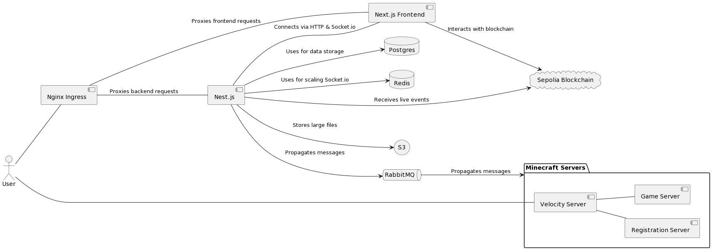

# Minechain

Minechain is a captivating combination of Minecraft's immersive virtual world and the innovative realm of blockchain. Our unique project transforms the Minecraft universe into 1024 distinct plots, each of these represented by a token within a custom-built smart contract on the Sepolia Blockchain.

  

## ℹ️ About The Project

In the core of our project lies the innovative concept of digital ownership. Users can link their Minecraft account with their digital wallet, facilitating the purchase and ownership of unique plots within the Minecraft universe. Once a user acquires a plot, they can freely build and interact within their own virtual property, introducing a whole new dimension of personalized experience and immersion in the world of Minecraft.

Our smart contract does more than just mapping ownership; it also serves a practical role in our ecosystem. By implementing a Harberger Tax mechanism, the smart contract helps to maintain the operational costs of running the Minecraft servers, ensuring the project's sustainability and introducing users to fascinating real-world economic models in a gaming context.

In addition, Minechain brings a host of cool features:

* __Automatic ENS Support__ : Ensuring seamless interaction with Ethereum addresses,.
* __Profile Pictures from Minecraft Skins__ : Users can generate profile pictures using their unique Minecraft skins, enhancing the personalization.
* __Real-time Property Updates__ : Live updates on property status provide a dynamic, real-time gaming experience.
* __Full Web 3.0 Authentication__ : Secure, decentralized user authentication using Web 3.0 standards.

Moreover, Minechain comes with a live view of the Minecraft map on our web interface. Leveraging the Leaflet library, we provide users with a real-time visual representation of the game world, further enriching the sense of digital ownership and community.

## ⚒️ Technical Overview

Minechain is a complex yet elegant integration of blockchain and Minecraft using various cutting-edge technologies. Let's delve into the technical aspects:

### Frontend
Our frontend is developed using Typescript, Redux, and Next.js. We leverage the Ethers library for interacting with Ethereum blockchain and smart contracts. For real-time communication with our backend, we use Socket.io.

### Backend
The backend is crafted using Nest.js, a progressive Node.js framework, and is also written entirely in typescript. It integrates several different services for efficient performance:

* __PostgreSQL Database__: Used for data persistence and relational data management.
* __Redis__: An in-memory data structure store, primarily used a message broker to scale Socket.io.
* __RabbitMQ__: A message-broker that offers a common platform for sending/receiving messages. It is primarily used to propagate messages about blockchain events to the Minecraft environment.
* __S3__: Amazon's Simple Storage Service is used for storing larger files and assets. This includes renders of property and user skins that serve as profile pictures.
* __Alchemy__: This Web 3.0 API is integrated to update a user's display name based on the associated ENS name.
* __Ethers__: A Web 3.0 Typescript Library, enabling the backend to receive and process live events from the blockchain.

We take pride in our comprehensive unit testing, with over 50 tests ensuring the reliability of our backend systems.

### Blockchain
The project employs a custom-built smart contract on the Sepolia Blockchain, developed using Solidity, OpenZeppelin Contracts, and Hardhat. We've created a system of 1024 unique tokens, each representing a plot of land in a Minecraft server.

The smart contract is thoroughly tested and verified with over 40 tests ensuring its robustness and security.

### Minecraft Servers
Our Minecraft component incorporates two servers and uses Velocity, a Minecraft proxy allowing connection of multiple Minecraft servers into a single network. We've developed custom Java plugins for Velocity and the main server, while the registration server uses a Skript plugin.

These servers interact with the backend using RabbitMQ, ensuring real-time communication and user authentication. The main server is designed to listen to messages, emit messages, make RPC calls, and provide an RPC endpoint. This endpoint enables the backend to collect real-time data on property layout, allowing it to render an image representing the property.

### DevOps
We harness the power of Docker for containerization of services, ensuring their isolated and consistent execution. Kubernetes and AWS EKS handle the orchestration of these containers, providing automatic deployment, scaling, and management of containerized applications. Terraform is used as an infrastructure as code (IaC) tool for providing, versioning, and managing our cloud resources in a safe, predictable manner.

In essence, Minechain merges the immersive world of gaming with the revolutionary technology of blockchain, introducing a new era of digital ownership and immersive gaming experiences.

## 📃 License

Copyright (c) Carson Weeks. All rights reserved.

Licensed under the MIT License.
